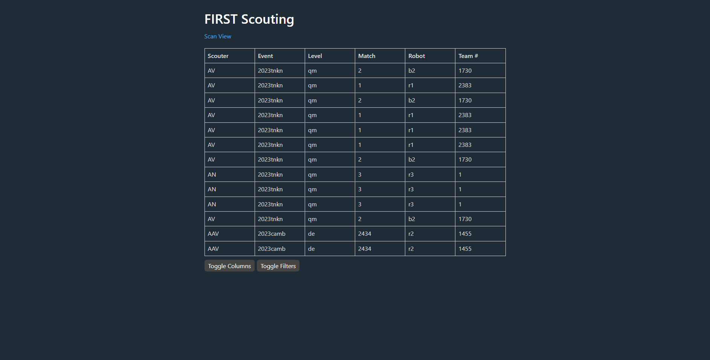
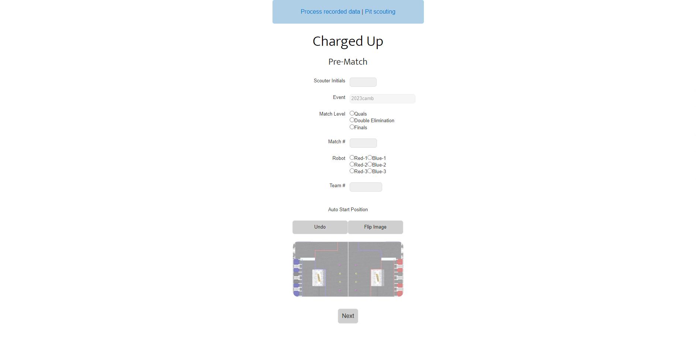
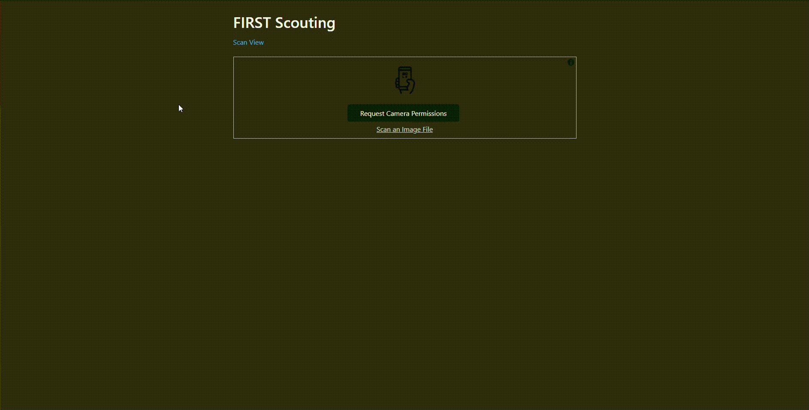

#  Scouting

A(n unofficial) scouting application for Team 1280.

## Setup

Clone the git repo, run `yarn` to install dependencies, and then `node .` to host the server at http://localhost:3000. An instance of ScoutingPASS will run simultaneously at http://localhost:8000.

## Screenshots/Videos

