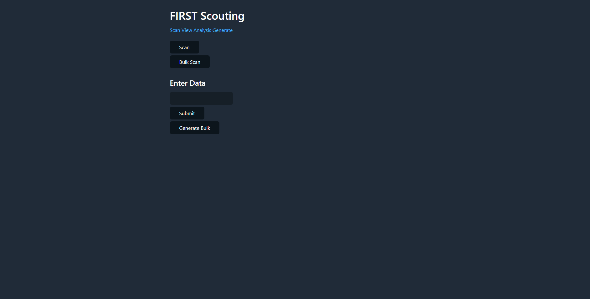
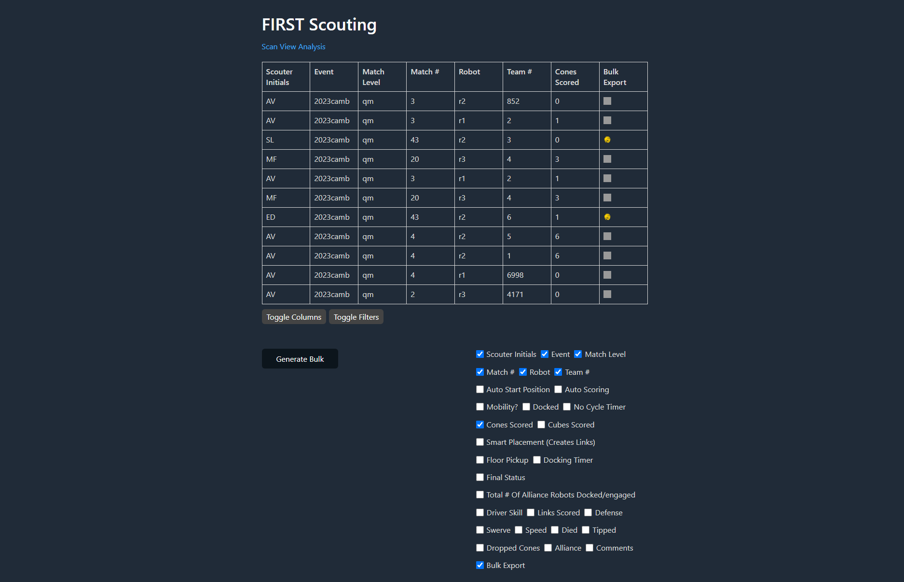
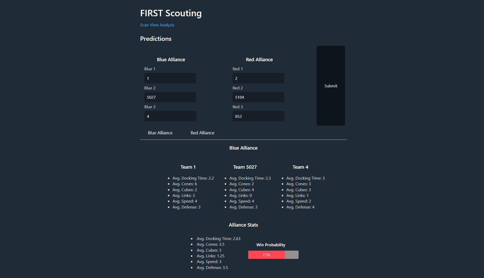

#  Scouting

A scouting application for Team 1280.

## Setup

After cloning, create a config file. The config file should include:

```json
{
    "data": "location to store scouted data",
    "headers": [
        // Any headers that should be shown on default when viewing data
    ],
    "averages": [
        // Any columns in the data that should also have corresponding team- and alliance-wide averages during team lookup and predictions.
    ],
    "weights": {
        // Dictionary of weights in ScoutingPASS for all averaged data when calculating win probabilities
    },
    "stages": [
        // List of stages in the game
        // eg. "premature", "auton", "teleop", "endgame"
    ],
    "PASS": {
        // ScoutingPASS config
    },
    "PASSConfigPath": "Path to where ScoutingPASS config should be written/overwritten",
    "keys": {
        // Dictionary of keys in ScoutingPASS data and their corresponding display names
    }
}
```

After, run `yarn build PATH_TO_CONFIG_FILE`, and `yarn start PATH_TO_CONFIG_FILE HOST`. For example:

```sh
> yarn build ./config.json
> yarn start ./config.json localhost # if no host is specified, defaults to localhost
Server running at http://localhost:3000/
Scouting P.A.S.S. Server running at http://localhost:8000/
```

## Screenshots/Videos





